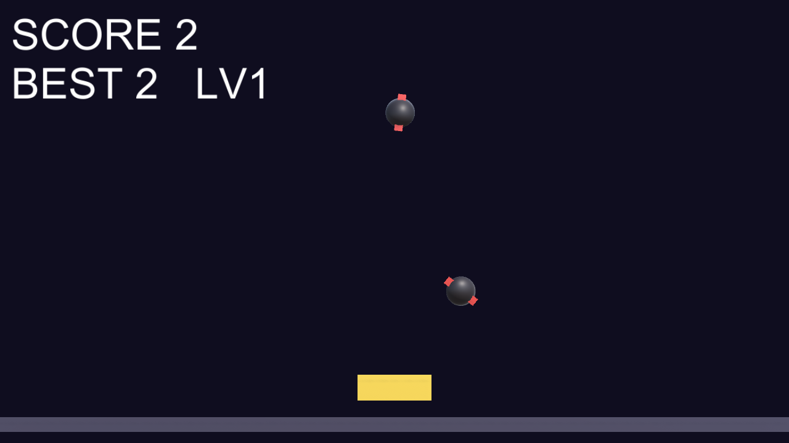

# ⭐ Star Catcher

> 落ちてくる星をバスケットでキャッチし、爆弾を避けてスコアを伸ばせ。

バスケットを左右に動かして落下する星をキャッチし、得点を稼ぐアーケードゲームです。爆弾に当たると失敗。時間の経過とともに難易度が上がり、連続キャッチでコンボが発生します。Unity で開発し、WebGL ビルドを GitHub Pages 上でブラウザから直接プレイできます。


🔗 **[Live Demo](https://masafykun.github.io/star-catcher/)**

---

## 📸 スクリーンショット


---

## 🎮 操作方法
| 操作 | 動作 |
|---|---|
| ← / → | バスケットを左右に移動 |
| A / D | バスケットを左右に移動 |
| R | リスタート（ゲームオーバー時） |

星をキャッチで加点、爆弾に当たると失敗。取り逃しや爆弾でコンボはリセットされます。

---

## ✨ 特徴
- **シンプルな左右移動** — バスケットを動かして星を集める直感操作
- **爆弾回避** — 一定確率で混じる爆弾を避ける緊張感
- **段階的な難易度上昇** — 時間経過でレベルが上がり落下が加速
- **コンボシステム** — 連続キャッチでコンボ、取り逃しでリセット
- **スコア保存** — ベストスコアは PlayerPrefs に保存

---

## 🛠️ 技術スタック
| カテゴリ | 技術 |
|---|---|
| ゲームエンジン | Unity (6000.0.77f1) |
| 言語 | C# |
| 配信ビルド | WebGL |
| ホスティング | GitHub Pages |

C# ソースコードは `src/` に、WebGL ビルドは `Build/` に格納されています。

---

## 🚀 セットアップ
```bash
# このリポジトリは WebGL ビルドを同梱しています。
# ローカルで動かす場合は、簡易 HTTP サーバー経由で index.html を開いてください
# （file:// 直開きでは WebGL が動作しません）。
python3 -m http.server 8000
# ブラウザで http://localhost:8000/ を開く
```

ソースから再ビルドする場合は、`src/` 内の C# スクリプトを Unity (6000.0.77f1) プロジェクトに取り込んでください。

---

## ライセンス
[](https://opensource.org/licenses/MIT)

このプロジェクトは **MIT ライセンス** のもとで公開しています。

© 2026 masafykun (https://github.com/masafykun)
